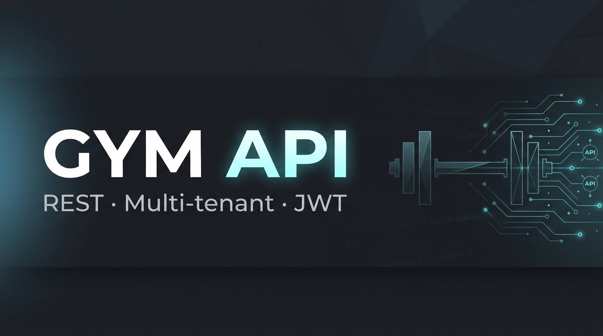

<p align="center">
  
</p>

<h1 align="center">GYM API</h1>

<p align="center">
  Backend <strong>REST</strong> pour la gestion de salles de sport · modèle <strong>multi-tenant</strong> (isolation par salle, <code>gymId</code>) · <strong>JWT</strong> · <strong>Prisma</strong> · <strong>OpenAPI</strong>
</p>

<div align="center">

[](https://nodejs.org/)
[](https://expressjs.com/)
[](https://www.typescriptlang.org/)
[](https://www.prisma.io/)

<br/>

[](https://www.sqlite.org/)
[](https://zod.dev/)
[](https://jwt.io/)
[](https://swagger.io/)

<br/>

[](http://localhost:5000/api/docs)
[](./LICENSE)

</div>

<p align="center">
  <a href="#sommaire"><strong>Documentation</strong></a> ·
  <a href="#démarrage"><strong>Démarrage</strong></a> ·
  <code>localhost:5000</code> ·
  <code>/api/docs</code>
</p>

<p align="center">
  <sub>Les clients <strong>React</strong> et <strong>Vue</strong> sont des <strong>dépôts séparés</strong> ; ils consomment cette API via <code>/api</code> (proxy en dev).</sub>
</p>

---

## Sommaire

1. [Vue d’ensemble](#vue-densemble)
2. [Stack technique](#stack-technique)
3. [Prérequis](#prérequis)
4. [Installation](#installation)
5. [Configuration](#configuration)
6. [Base de données](#base-de-données)
7. [Démarrage](#démarrage)
8. [Scripts npm](#scripts-npm)
9. [Structure du code](#structure-du-code)
10. [Surface API](#surface-api)
11. [Sécurité & multi-tenant](#sécurité--multi-tenant)
12. [Documentation OpenAPI](#documentation-openapi)
13. [Qualité, tests & production](#qualité-tests--production)
14. [Intégration avec les frontends](#intégration-avec-les-frontends)
15. [Dépannage](#dépannage)

---

## Vue d’ensemble

**Dépôt :** [github.com/Moustapha-Ndoye-dev/gym-app-back](https://github.com/Moustapha-Ndoye-dev/gym-app-back)

| Aspect | Détail |
|--------|--------|
| **Rôle** | Authentification JWT, CRUD métier, statistiques, console super-admin |
| **Modèle** | Une **salle** (`Gym`) possède des utilisateurs, membres, abonnements, tickets, produits, transactions, journaux d’accès |
| **Auth** | Rôles : `superadmin`, `admin`, `cashier`, `controller`, `member` |
| **Port par défaut** | `5000` (`PORT` dans `.env`) |

Les requêtes authentifiées (hors super-admin) sont **filtrées par salle** à partir du `gymId` porté par le token JWT.

---

## Stack technique

| Couche | Technologie |
|--------|-------------|
| Runtime | Node.js (LTS recommandé) |
| Framework HTTP | **Express 5** |
| Langage | **TypeScript** |
| ORM | **Prisma 6** |
| Base par défaut | **SQLite** (`better-sqlite3`) — le schéma Prisma permet d’évoluer vers PostgreSQL / MySQL |
| Validation | **Zod** (schémas sur les entrées API) |
| Auth | **JWT** (`jsonwebtoken`), mots de passe **bcrypt** |
| Durcissement | **Helmet**, **express-rate-limit** |
| Logs | **Winston** |
| Spec API | **Swagger** (`swagger-jsdoc`, `swagger-ui-express`) |

---

## Prérequis

- **Node.js** LTS (v20 ou v22 selon votre politique interne)
- **npm** (ou `pnpm` / `yarn` si vous adaptez les commandes)

---

## Installation

```bash
git clone https://github.com/Moustapha-Ndoye-dev/gym-app-back.git
cd gym-app-back
npm install
```

---

## Configuration

Dupliquez le fichier d’exemple puis éditez les valeurs sensibles :

```bash
cp .env.example .env
# Windows (PowerShell) : Copy-Item .env.example .env
```

### Variables d’environnement essentielles

| Variable | Description |
|----------|-------------|
| `PORT` | Port d’écoute (défaut : `5000`) |
| `DATABASE_URL` | Chaîne Prisma, ex. `file:./prisma/gym_database.sqlite` |
| `JWT_SECRET` | Secret de signature JWT — **obligatoire**, long et aléatoire en production |
| `NODE_ENV` | `development` ou `production` |
| `DEFAULT_ADMIN_PASSWORD` | Mot de passe initial du compte admin de démo (voir règles dans `.env.example`) |
| `DEFAULT_SUPERADMIN_PASSWORD` | Idem pour le super-admin |
| `API_RATE_LIMIT_MAX` / `LOGIN_RATE_LIMIT_MAX` | Limites de débit (optionnel) |

Ne commitez **jamais** le fichier `.env` réel.

---

## Base de données

Synchronisation du schéma Prisma avec la base locale :

```bash
npm run db:push
npm run db:generate
```

- **`db:push`** : applique le schéma sans migration versionnée (adapté au dev / prototypage).
- **`db:generate`** : régénère le client Prisma dans `node_modules` / sortie configurée.

Exploration visuelle :

```bash
npm run db:generate
npm run db:studio
```

---

## Démarrage

### Développement

```bash
npm run dev
```

Le serveur redémarre à chaque modification (`nodemon` + `ts-node`).

### Production (build puis exécution Node)

```bash
npm run build
npm start
```

Point d’entrée compilé : `dist/server.js`.

### Vérification rapide

- Racine API : `GET http://localhost:5000/`
- Interface Swagger : `http://localhost:5000/api/docs`

---

## Scripts npm

| Script | Usage |
|--------|--------|
| `npm run dev` | Serveur de développement avec rechargement |
| `npm run build` | Compilation TypeScript → `dist/` |
| `npm start` | Exécution du build (`node dist/server.js`) |
| `npm run db:push` | Synchronisation schéma → base |
| `npm run db:generate` | Génération du client Prisma |
| `npm run db:studio` | Prisma Studio |
| `npm run lint` | ESLint sur `src/**/*.ts` |
| `npm run format` | Prettier sur les sources |
| `npm run test` | Suite de tests API (script PowerShell : `tests/test-all.ps1`) |
| `npm run seed` | Script d’amorçage (`ts-node src/config/db.ts`) |
| `npm run monitor:start` | Démarrage PM2 via `ecosystem.config.js` (processus `gym-api`) |
| `npm run monitor:stop` | Arrêt du processus PM2 `gym-api` |
| `npm run monitor:logs` / `monitor:status` / `monitor:dash` | Opérations PM2 |

---

## Structure du code

```
src/
├── config/          # Prisma, logger, sécurité (JWT), locale Zod
├── controllers/     # Logique HTTP par domaine métier
├── middleware/      # Authentification, rate limiting, validation Zod
├── models/          # Accès données (souvent wrappers Prisma)
├── routes/          # Montage Express par ressource
├── validation/      # Schémas Zod réutilisables
├── utils/           # Utilitaires transverses
└── server.ts        # Bootstrap : middlewares, routes, Swagger, écoute
```

Les routes métier sont montées sous le préfixe `/api`.

---

## Surface API

Préfixes principaux (tous sous `/api` sauf indication) :

| Préfixe | Domaine |
|---------|---------|
| `/api/auth` | Connexion, enregistrement salle |
| `/api/members` | Adhérents |
| `/api/activities` | Activités / cours |
| `/api/subscriptions` | Formules d’abonnement |
| `/api/tickets` | Tickets journaliers |
| `/api/access` | Vérification QR, historique des accès |
| `/api/transactions` | Encaissements / mouvements |
| `/api/users` | Comptes staff de la salle |
| `/api/products` | Catalogue boutique |
| `/api/stats` | Agrégats dashboard |
| `/api/super` | Console super-administrateur (multi-salles) |

La liste exhaustive et les corps de requête sont documentés dans **Swagger**.

---

## Sécurité & multi-tenant

- **JWT** : durée limitée (ex. 24 h), payload contenant `id`, `username`, `role`, `gymId`.
- **Contrôle à la connexion** : pour les comptes liés à une salle, vérification du statut de la salle (active, non bloquée, abonnement SaaS si applicable).
- **RBAC** : les routeurs appliquent des rôles minimum (ex. contrôleur limité au module accès).
- **Isolation** : les requêtes métier filtrent systématiquement par `gymId` du token (sauf chemins super-admin).
- **Rate limiting** : limite globale + renforcement sur les routes sensibles (login).
- **Validation** : entrées normalisées et rejetées explicitement via Zod.
- **Helmet** : en-têtes HTTP orientés sécurité.

---

## Documentation OpenAPI

Une fois le serveur démarré :

**URL :** `http://localhost:<PORT>/api/docs`

Vous pouvez tester les endpoints protégés en renseignant le schéma **Bearer** avec un JWT obtenu via `POST /api/auth/login`.

---

## Qualité, tests & production

- **Lint / format** : `npm run lint`, `npm run format`.
- **Tests** : `npm run test` (environnement Windows / PowerShell pour le script fourni).
- **PM2** : voir scripts `monitor:*` et `ecosystem.config.js` pour un déploiement process manager classique.

Avant une mise en production, vérifiez au minimum : `JWT_SECRET`, mots de passe par défaut **désactivés ou renforcés**, `NODE_ENV=production`, et une stratégie de **sauvegarde** de la base (fichier SQLite ou instance managée si vous migrez Prisma).

---

## Intégration avec les frontends

Ce backend est **agnostique** du framework UI. Les dépôts **React** et **Vue** :

1. Clonent ce dépôt (ou pointent vers une API déployée).
2. En développement, utilisent le **proxy Vite** pour rediriger `/api` vers `http://localhost:5000`.

Les origines CORS autorisées en développement incluent notamment `http://localhost:3000`, `http://localhost:3001` et `http://localhost:5173`. Pour un nouveau port front, ajoutez-le dans `server.ts` (`cors.origin`) ou externalisez la liste via variable d’environnement si vous faites évoluer le projet.

---

## Dépannage

| Symptôme | Piste |
|----------|--------|
| Erreur au démarrage sur `JWT_SECRET` | Renseigner une valeur non factice dans `.env` |
| Client Prisma obsolète | `npm run db:generate` après tout changement de `schema.prisma` |
| 401 systématique | Vérifier l’en-tête `Authorization: Bearer <token>` et l’expiration du JWT |
| Front « ne joint pas » l’API | Backend démarré ? Même host/port que le proxy Vite ? CORS si appel direct sans proxy |

---

## Auteur

**Moustapha Ndoye**
